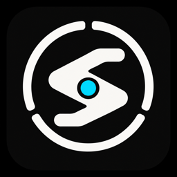
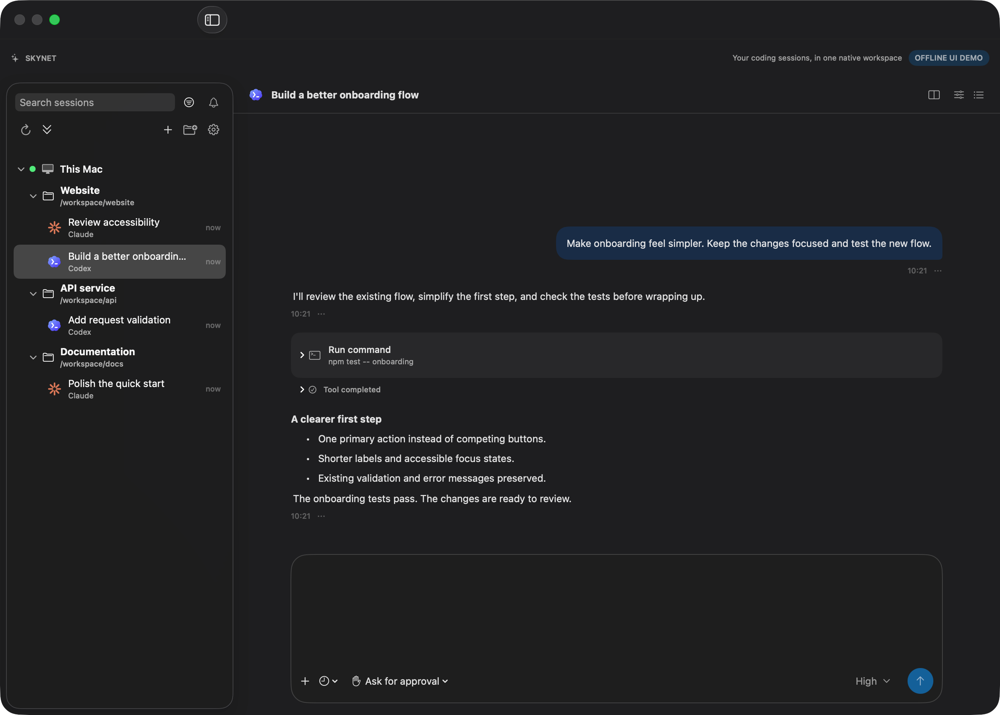
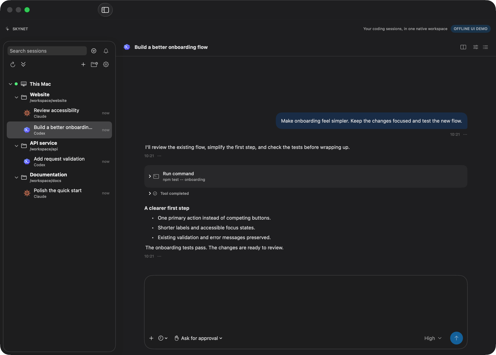
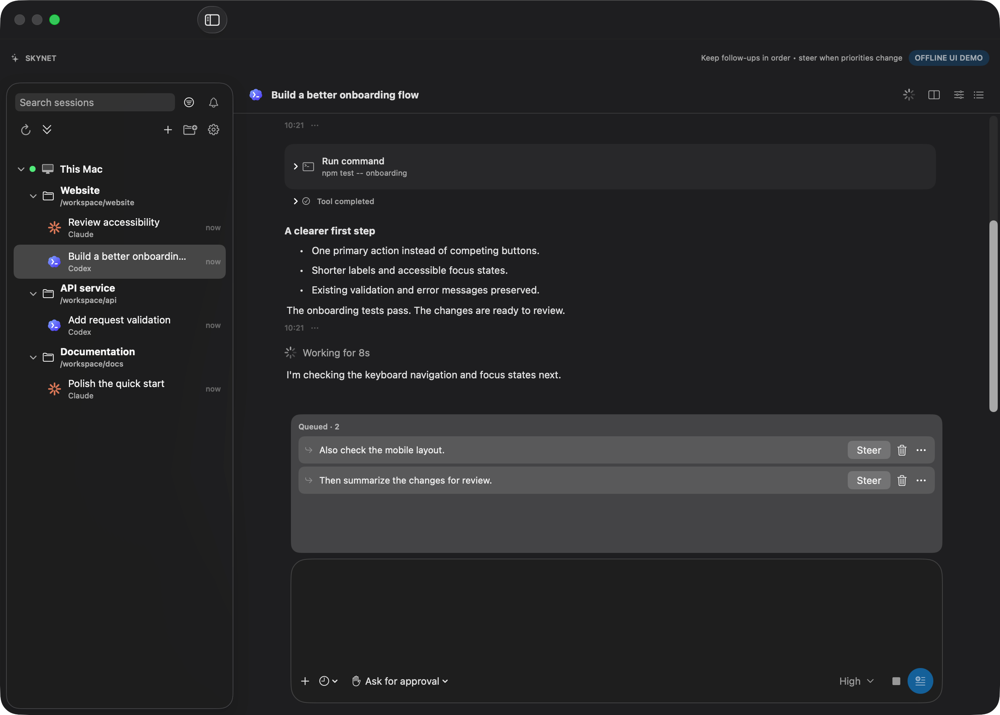

<p align="center">
  
</p>

<h1 align="center">Skynet</h1>

<p align="center">
  <strong>A native workspace for your coding agents.</strong><br>
  Codex &amp; Claude Code. Local &amp; SSH. One place to keep the work moving.
</p>

<p align="center">
  <a href="#demo">Demo</a> ·
  <a href="#what-you-can-do">Features</a> ·
  <a href="#quick-start">Quick start</a> ·
  <a href="docs/architecture.md">Architecture</a>
</p>

<p align="center"><code>macOS 14+</code> &nbsp; <code>SwiftUI</code> &nbsp; <code>Local + SSH</code></p>



Skynet brings CLI-backed coding sessions into a native macOS interface: switch projects,
read the conversation, line up follow-ups, and open the tools you need without losing context.
Your existing provider CLI does the agent work; Skynet handles the workspace around it.

## Demo



**Read → queue → continue.** Keep follow-ups visible while a turn is running.
Use **Steer** when priorities change, or reorder the waiting messages.

<details>
<summary>Take a closer look at the queue</summary>



</details>

> These images render the actual macOS SwiftUI views with isolated sample data.
> The GIF is an offline, scripted UI walkthrough—not a recording of live provider execution.
> No private conversations, credentials or real remote hosts are included.
> Demo assets use standard sRGB color; device profiles and source metadata are not copied.

## What you can do

| Keep context | Direct the work | Stay close to the code |
| --- | --- | --- |
| Group sessions by project and machine | Queue follow-ups, reorder them, or Steer | Open **Review**, **Files** and **Terminal** |
| Show cached sessions before refreshing | Review tool requests and stop the owning turn | Use the built-in **Browser** |
| Load older history without loading everything | See subagents and background activity | Ask a separate question with Codex **Side chat** |

- **Local and remote.** Run supported CLIs on this Mac or through SSH; connectivity hints
  update independently of history discovery, without clearing cached sessions.
- **A native composer.** Per-session drafts, undo/redo, skill and session references,
  image attachments, model controls and scheduled sending while the App is running.
- **Portable conversations.** Export stored history as JSON or Markdown.

Capabilities vary by provider. Side chat uses Codex's native side-conversation path;
Claude's auxiliary-chat entry uses the CLI. A visible action does not imply every remote
or custom-provider variant has been verified.

## Quick start

You need macOS 14+, full Xcode, and a supported provider CLI installed and authenticated
on the machine where it will run. Codex and Claude Code are built in; compatible executables
and default arguments can be configured in Skynet Settings.

### Build the macOS app

From the repository root:

```sh
# Point this at your full Xcode installation, not Command Line Tools.
export DEVELOPER_DIR="/Applications/Xcode.app/Contents/Developer"

xcodebuild -project Skynet.xcodeproj \
  -scheme SkynetMac -configuration Release \
  -destination 'platform=macOS' -derivedDataPath DerivedData

open DerivedData/Build/Products/Release/Skynet.app
```

If Xcode lives elsewhere, adjust `DEVELOPER_DIR`. `xcode-select` pointing to
Command Line Tools does **not** mean full Xcode is missing.

### Start working

1. Add a project folder, or select a discovered session in the sidebar.
2. Choose a provider and the appropriate model/permission mode.
3. Send a prompt. While it runs, add follow-ups to the queue.
4. Open the top-right side-panel menu for Review, Terminal, Browser, Files or Side chat.

For SSH sessions, install/authenticate the CLI on the remote machine and configure its
host alias in your SSH configuration. Skynet's SSH connectivity check is not a provider-service health check.

<details>
<summary>Development, tests and demo assets</summary>

Run the shared Core tests using the same Xcode toolchain:

```sh
swift test --package-path Packages/SkynetCore
```

The Xcode project is checked in. After changing targets or build settings, edit
`project.yml` and regenerate with XcodeGen:

```sh
xcodegen generate --spec project.yml
```

Regenerate the README images and GIF on macOS:

```sh
zsh Design/render-readme-demo.sh
```

The renderer uses production views with an isolated model. It does not open the installed
App, load its session store, discover remote hosts or send provider messages.
Verified App updates replace the installed copy directly, without old-version backups.

</details>

## Project map

| Target | Role |
| --- | --- |
| `SkynetMac` | Native macOS client with local/SSH CLI execution |
| `SkynetCore` | Shared provider, execution, transcript and persistence logic |
| `Skynet` | iOS/iPadOS client and relay contracts; never launches CLIs itself |

macOS is the current focus. Production relay transport is **not configured by default**;
paired-device end-to-end operation is not presented as a completed feature.

Read the [architecture boundaries](docs/architecture.md) and
[migration scope](docs/hapi_migration_audit.md) for implementation details.
Agent memory, QA status and debug history stay local and out of Git.
